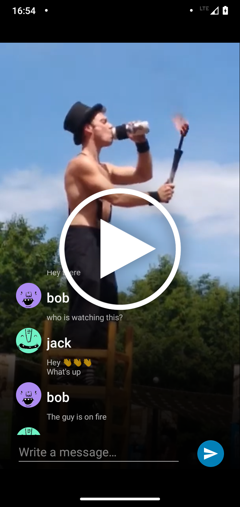

# Important
**This repository is now archived. You can find this sample and more in the [Android Samples repository](https://github.com/GetStream/Android-Samples) instead.**

# Build a Livestream Video & Chat App for Android

This repository is part of a tutorial on how to build a livestream video and chat application for Android (with Kotlin), originally published on [The Stream Blog](https://getstream.io/blog/livestream-video-and-chat-app-android/).

## Building the Android App

1. Add a file inside project root directory named `secret.properties` having the following contents:

```
StreamApiKey=xxx
UserToken=xxx
```

2. Replace `xxx` with your values. 

* `StreamApiKey` is a public key which you can get by registering your chat app on getstream.io.
* `UserToken` is a JWT token of your app user. You can generate one here: https://getstream.io/chat/docs/token_generator/?language=kotlin. You'll need to use there your private key (`secret` from getstream.io dashboard) and pass your desired user ID.

3. `./gradlew build`

## Final Result

[](https://youtu.be/_Aec_6UjtOI)

**Official Blog Post / Tutorial**: [https://getstream.io/blog/livestream-video-and-chat-app-android/](https://getstream.io/blog/livestream-video-and-chat-app-android/)
